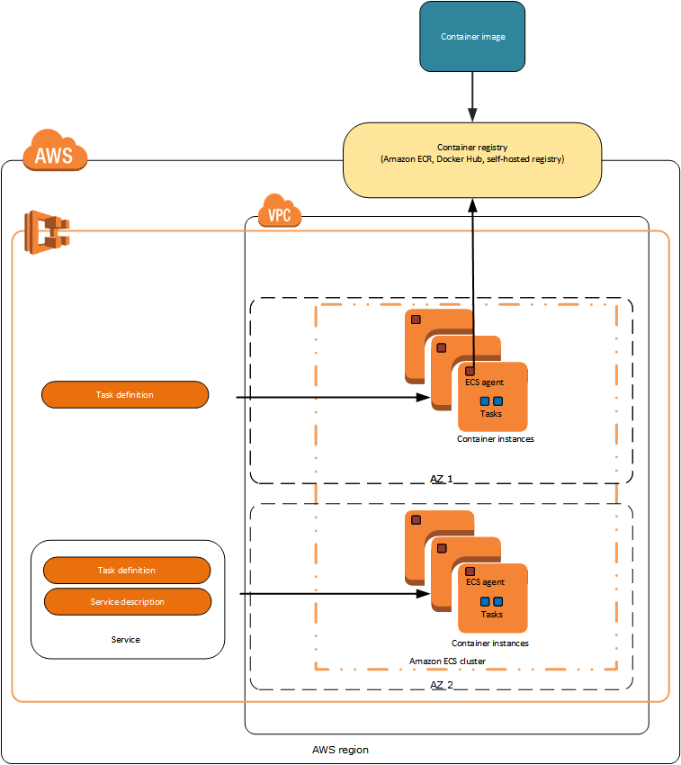
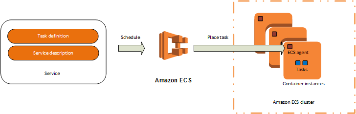

## Notes on AWS ECS
Creating notes per task *CO-2478* Familiarize with the AWS Container Infrastructure. Using the instructions provided by Amazon to spin up docker containers on their ECS service.

#### Vocabulary Concepts
Overview


The major components in Amazon ECS are:

* Task Definition: The task definition is a text file, in JSON format, describing the containers that together form an application. Task definitions specify various parameters for the application e.g. container image repositories, ports, storage etc.
* Tasks and Scheduler: A task is an instance of a task definition, created at runtime on a container instance within the cluster. The task scheduler is responsible for placing tasks on container instances.

* Service: A service is a group of tasks that are created and maintained as instances of a task definition. The scheduler maintains the desired count of tasks in the service. A service can optionally run behind a load balancer. The load balancer distributes traffic across the tasks that are associated with the service.
* Cluster: A cluster is a logical grouping of EC2 instances on which ECS tasks are run.
* Container Agent: The container agent runs on each EC2 instance within an ECS cluster. The agent sends telemetry data about the instance’s tasks and resource utilization to Amazon ECS. It will also start and stop tasks based on requests from ECS.
* Image Repository: Amazon ECS downloads container images from container registries, which may exist within or outside of AWS, such as a accessible private Docker registry or Docker Hub.


Example of a JSON *task definition*. The following is an example of a simple task definition containing a single container that runs an Nginx web server.
```json
{
      "family": "webserver",
      "containerDefinitions": [
      {
              "name": "web",
              "image": "nginx",
              "cpu": 99,
              "memory": 100,
              "portMappings": [{
                      "containerPort": 80,
                      "hostPort": 80
              }]
      }]
}
```

### AWS ECS CLI
Amazon provides a high-level commands for ECS using this command line tool to simplify creating, updating, and monitoring clusters and tasks from a local dev environment.

##### Install ECS CLI

For Mac OSX:
```shell
$ sudo curl -o /usr/local/bin/ecs-cli https://s3.amazonaws.com/amazon-ecs-cli/ecs-cli-darwin-amd64-latest
```
For Linux systems:
```shell
$ sudo curl -o /usr/local/bin/ecs-cli https://s3.amazonaws.com/amazon-ecs-cli/ecs-cli-linux-amd64-latest

```
Fix the permission on the executable:
```shell
$ sudo chmod +x /usr/local/bin/ecs-cli
```

Replace they keys with your own:
```
AWS_ACCESS_KEY_ID=ReplaceWithKey
AWS_SECRET_ACCESS_KEY=ReplaceWithKey
```

Configure the tool and set the default location(*For this instance I used us-east-2 so I can run tests away from the production environment*):
```shell
ecs-cli configure --region us-east-2 --access-key $AWS_ACCESS_KEY_ID --secret-key $AWS_SECRET_ACCESS_KEY --cluster ecs-cli-demo
```


##### Commands
Commands related to ECS deployment process

Check the installed version of ECS cli tool:
```shell
$ ecs-cli --version
ecs-cli version 0.5.0 (1aa8028)
```


Reference: [AWS ECS CLI](http://docs.aws.amazon.com/AmazonECS/latest/developerguide/get-set-up-for-amazon-ecs.html)


### Demo

Steps:
* Create the Cluster where the app will live
* Download the repo or create the yml file
* Bring up the containers based off of the yml

##### Create the Cluster

ECS requires a cluster which will house the environment.
```shell
ecs-cli up --keypair id_rsa --capability-iam --size 2 --instance-type t1.small
```


##### Create the yml

This yml will spin up a hello-world wordpress site (ew) which will later be replaced with the Ruby stack.
```yml
version: '2'
services:
  wordpress:
    image: wordpress
    cpu_shares: 100
    mem_limit: 524288000
    ports:
      - "80:80"
    links:
      - mysql
  mysql:
    image: mysql
    cpu_shares: 100
    mem_limit: 524288000
    environment:
      MYSQL_ROOT_PASSWORD: potato.pass
```

OR skip this step if you are working off of the repo.
